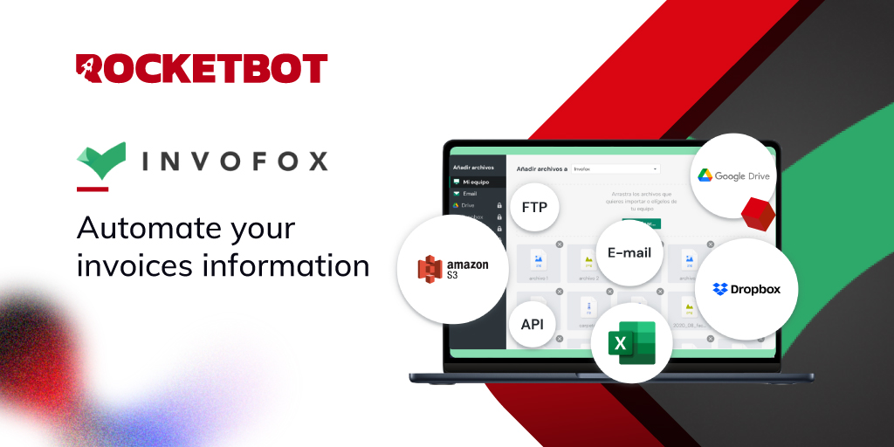

# Invofox
  
Módulo para conexão à Invofox e automatização de faturas 

*Read this in other languages: [English](Manual_Invofox.md), [Español](Manual_Invofox.es.md), [Português](Manual_Invofox.pr.md).*
  

## Como instalar este módulo
  
__Baixe__ e __instale__ o conteúdo na pasta 'modules' no caminho do Rocketbot  

## Descrição do comando

### Configurar credenciais Invofox
  
Configure credenciais para conectar com o API do Invofox.
|Parâmetros|Descrição|exemplo|
| --- | --- | --- |
|Sessão|Sessão a utilizar|Invofox1|
|API Key|API Key do Invofox|$2b$10$3/6YJ2kYHE0rtUrks8PO7.IPDdgrNsGGTCpDLY6s8pTNzcjiQFFFe|
|Atribuir resultado a variável|Atribuir resultado da conexão a variável|result|

### Obter empresas
  
Obtenha uma lista de empresas e seus dados.
|Parâmetros|Descrição|exemplo|
| --- | --- | --- |
|Sessão|Sessão a utilizar|Invofox1|
|Saltar|Quantidade de documentos a saltar|0|
|Limite de empresas|Quantidade máxima de empresas a obter|10|
|Atribuir resultado a variável|Atribuir resultado da consulta a uma variável|result|

### Carregar documentos
  
Carrega um ou mais documentos na plataforma Invofox. Utilize um dos dois métodos de carregamento: Arquivo ou Pasta.
|Parâmetros|Descrição|exemplo|
| --- | --- | --- |
|Sessão|Sessão a utilizar|Invofox1|
|Arquivo|Caminho do arquivo a carregar|C:/Users/usuario/Desktop/Arquivo.pdf|
|Arquivos|Caminho da pasta que contém os arquivos a carregar|C:/Users/usuario/Desktop/Arquivos|
|Tipo de documento|Tipo de documento a carregar|invoice|
|ID Companhia|ID da Companhia à qual o documento será associado|54aadbb7e79e2aba5d25f3e3|
|ID Lote de carga|ID do lote de carga ao qual o documento será associado|2|
|Fechar lote|Marque esta caixa se você quiser fechar o lote de carga após carregar os arquivos.|True|
|Dados adicionais|Dados adicionais que serão anexados aos arquivos. Deve ser uma matriz de objetos com o nome do arquivo ao qual o dado será anexado e o dado em si.|[ { _filename: \<name of the file to which attach this data>, \<key>: \<value> }, ... { _filename: \<name of the file to which attach this data>, \<key>: \<value> } ]|
|Atribuir resultado a variável|Atribuir resultado do upload de arquivos a uma variável.|result|

### Obter documentos
  
Obter uma lista com os ID dos documentos de uma sessão de Invofox.
|Parâmetros|Descrição|exemplo|
| --- | --- | --- |
|Sessão|Sessão a utilizar|Invofox1|
|Saltar|Quantidade de documentos a saltar|0|
|Limite de documentos|Quantidade máxima de documentos a obter|50|
|Tipo de documento|Tipo de documento a obter|invoice|
|Estado público|Estado público dos documentos a obter|processing|
|ID Companhia|ID da Companhia da qual se obterão os documentos|54aadbb7e79e2aba5d25f3e3|
|Atribuir resultado a variável|Atribuir resultado da execução a uma variável|result|

### Obter documento por ID
  
Obter informação de um documento passando o seu ID.
|Parâmetros|Descrição|exemplo|
| --- | --- | --- |
|Sessão|Sessão a utilizar|Invofox1|
|ID Documento|ID do documento a obter|52543ec6d13ac7000bb90823|
|Valores a obter|Valores a obter do documento|_id,account,environment,company,creator,clientData|
|Atribuir resultado a variável|Atribuir resultado da consulta a uma variável|result|

### Criar empresa
  
Criar uma empresa no Invofox.
|Parâmetros|Descrição|exemplo|
| --- | --- | --- |
|Sessão|Sessão a utilizar|Invofox1|
|Nome|Nome da empresa|Rocketbot|
|Tax ID|Tax ID da empresa|12345|
|Código do país|Código do país da empresa|ES|
|Atribuir resultado a variável|Atribuir resultado da consulta a uma variável|result|
